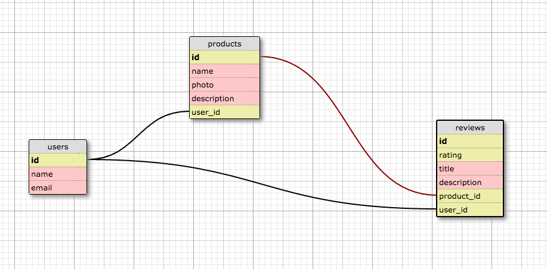

# App Name here

## User Stories

- A user can create an account and login (no authentication needed at this time)
- A user can update their account information (email, name)
- A user can view ALL of their products and reviews (on their profile page)

- A user can view ALL products listed in the webstore (on the main index)
- A user can create a product (Create)
- A user can see a product page (Read)
- A user can update a product (Update)
- A user can delete a product listing (Destroy)

## Optional User Story Additions

- A user can add a review to a product
- A user can edit a review to a product
- A user can upload a picture of a product

## Schema screenshot

-

## Installation Notes

Important down the road for listing development dependencies.

## Deployment details and link

- [App Name Link](https:yourthing.herokuapp.com)

