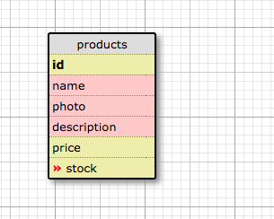

# Max 'n' Mike's Webstore

## User Stories

ITERATION 1
- A user can see all products on the products index
- A user can view the show page for a product
- An user can create a product (Create)
- An user can update a product (Update)
- An user can delete a product listing user(Destroy)

ITERATION 2

- An admin can login through the a link on the products index (user: admin, password: secret)
- An admin and user can view ALL products listed in a tabular view
- An admin and user can see a product page (Read)
- An admin can create a product (Create)
- An admin can update a product (Update)
- An admin can delete a product listing (Destroy)
- An admin can view the products index as a user
- An admin can have an inventory view (Tabular with alternating colors)
- The view will be reactive for mobile design

ITERATION 3

- A user can register and login
- An admin can create products with multiple categories
- A user can view products by categories and each product's categories
- A user will receive emails after signing up

## Potential User Story Additions

- A user can create an account and login (no authentication needed at this time)
- A user can update their account information (email, name)
- A user can view ALL of their products and reviews (on their profile page)
- A user can add a review to a product
- A user can edit a review to a product
- A user can upload a picture of a product

## Schema screenshot

-

## Installation Notes

New Gems Added to Development in Gemfile
  - gem 'shoulda'
  - gem 'factory_girl_rails'
  - gem 'faker'
  - gem 'capybara'
  - gem 'selenium-webdriver'
  - gem 'chromedriver-helper'

## Deployment details and link

- [Max 'n' Mike's Webstore](https://max-n-mikes-webshop.herokuapp.com/)

